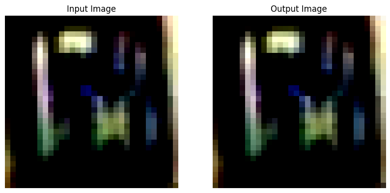

# 
Embedded Systems (EEL3090)

# Conversion of DL models from High-level (Python libraries) to C++ descriptions

## Team Members

- Sushant Ravva (B21CS084)
- Jaysukh Makvana (B21CS043)

## Objective

The primary objective of this project was to train and implement three different deep learning models using PyTorch. These models were trained on various datasets, and their trained parameters were used in inference tasks using efficient and fast C++ code.

## Steps

1. **Model Training**: Three distinct models (Autoencoder, ResNet, and VGG) were trained using PyTorch on the following datasets:

- Autoencoder: SVHN dataset (Task : Image Reconstruction)
- ResNet: CIFAR-10 dataset (Task : Image Classification)
- VGG: MNIST dataset (Task : Image Classification)

2. **Parameter Storage**: After training, the values of the trained parameters for each model were stored in a header file.

3. **Inference Task**: C++ code was written to perform inference tasks using the trained parameter values retrieved from the header file for efficient computation of the results.

## Autoencoder Image Reconstruction

**Dataset**: SVHN

**Task**: Reconstruction

**Description**: The Autoencoder model was trained on the SVHN dataset to reconstruct input images. The trained parameters were stored in a header file for later use in inference tasks.

**Advantage**: Autoencoders are well-suited for image reconstruction tasks as they can learn to encode and decode images efficiently, capturing the essential features and patterns in the data.

**How to Run?**:

1. Firstly add 4-Dimensional vector containing image in the `image.h` file of required model directory.
2. Now, run the the file `AutoEncodder.cpp` file using available compiler present in the device.
3. It will generate two files containing input image and output image in the same directory named as `input.txt` and `output.txt`.
4. Finally, to verify the results run the `plotter.ipynb` which will plot the both input and output images.

**Output**:

## ResNet Image Classification

**Dataset**: CIFAR-10

**Task**: Classification (10 classes)

**Description**: The ResNet model was trained on the CIFAR-10 dataset, which consists of 10 different classes. The trained parameters were stored in a header file for later use in inference tasks.

**Advantage**: ResNet architectures are powerful and effective for image classification tasks, as they can learn complex features while mitigating the vanishing gradient problem through the use of residual connections.

**How to Run?**:

1. Firstly add 4-Dimensional vector containing image in the `image.h` file of required model directory.
2. Now, run the the file `MiniResNet.cpp` file using available compiler present in the device.
3. It will generate file containing the scores for each class named as `output.txt`.
4. Now, Use the `getClass.cpp` file to get probabilities of occuring of each class and to get the predicted class result.

**Output**:

## VGG Image Classification

**Dataset**: MNIST

**Task**: Classification (10 classes)

**Description**: The VGG model was trained on the MNIST dataset, which consists of 10 different classes. The trained parameters were stored in a header file for later use in inference tasks.

**Advantage**: The VGG model is a popular and well-established architecture for image classification tasks, known for its depth and ability to learn hierarchical representations of features.

**How to Run?**:

1. Firstly add 4-Dimensional vector containing image in the `image.h` file of required model directory.
2. Now, run the the file `VGG.cpp` file using available compiler present in the device.
3. It will generate file containing the scores for each class named as `output.txt`.
4. Now, Use the `getClass.cpp` file to get probabilities of occuring of each class and to get the predicted class result.

**Output**:

## Conclusion

This project demonstrated the successful conversion of deep learning models trained using high-level Python libraries (PyTorch) into efficient C++ descriptions for inference tasks. By storing the trained parameters in header files and utilizing C++ code, the project aimed to achieve faster and more efficient computation of results during inference. The choice of models, including Autoencoder, ResNet, and VGG, was well-suited for their respective tasks of image reconstruction and classification, leveraging the strengths and advantages of each architecture. The project highlights the potential for deploying deep learning models in resource-constrained environments by leveraging the efficiency and performance of low-level languages like C++.
